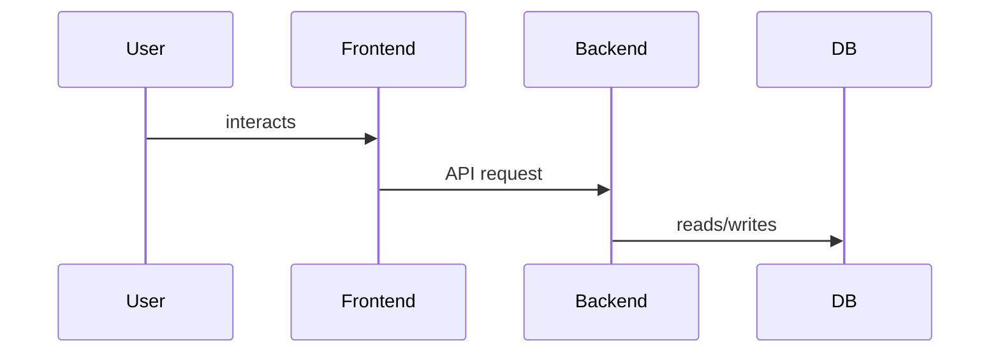

# Architecture Overview

Describe the high-level architecture, components, responsibilities, and data flow.

## Components

- Frontend — responsibilities
- API Gateway / Backend — responsibilities
- Data stores

## Data flow

